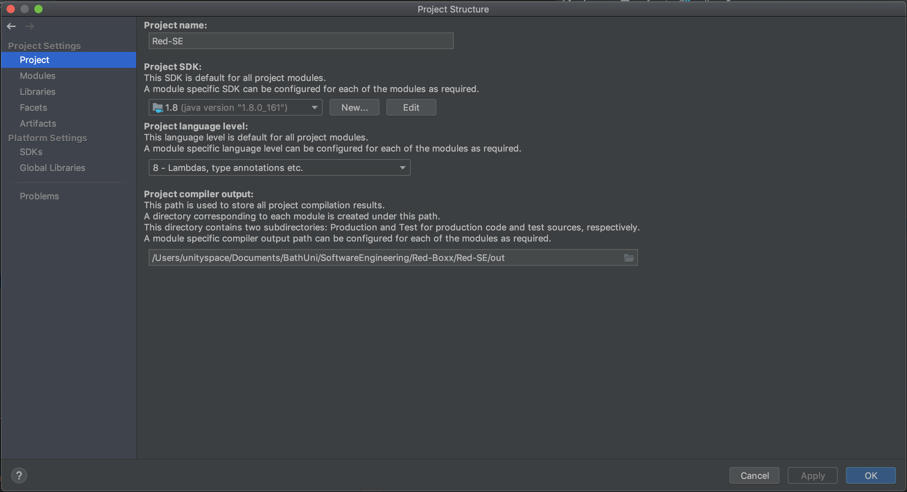
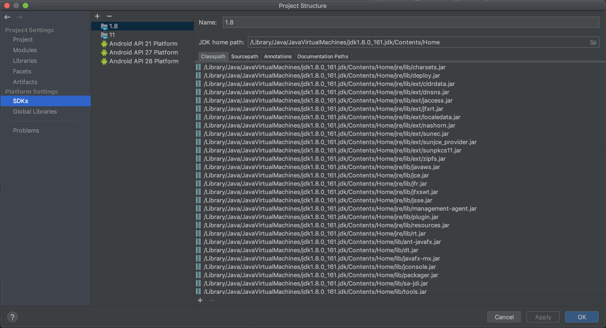
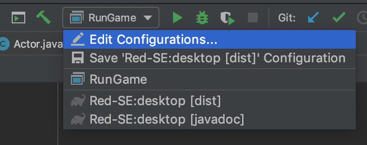
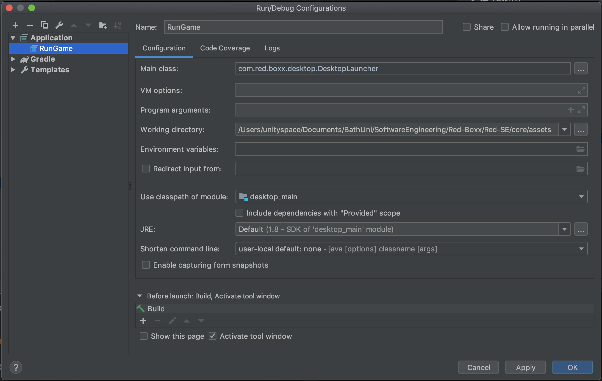
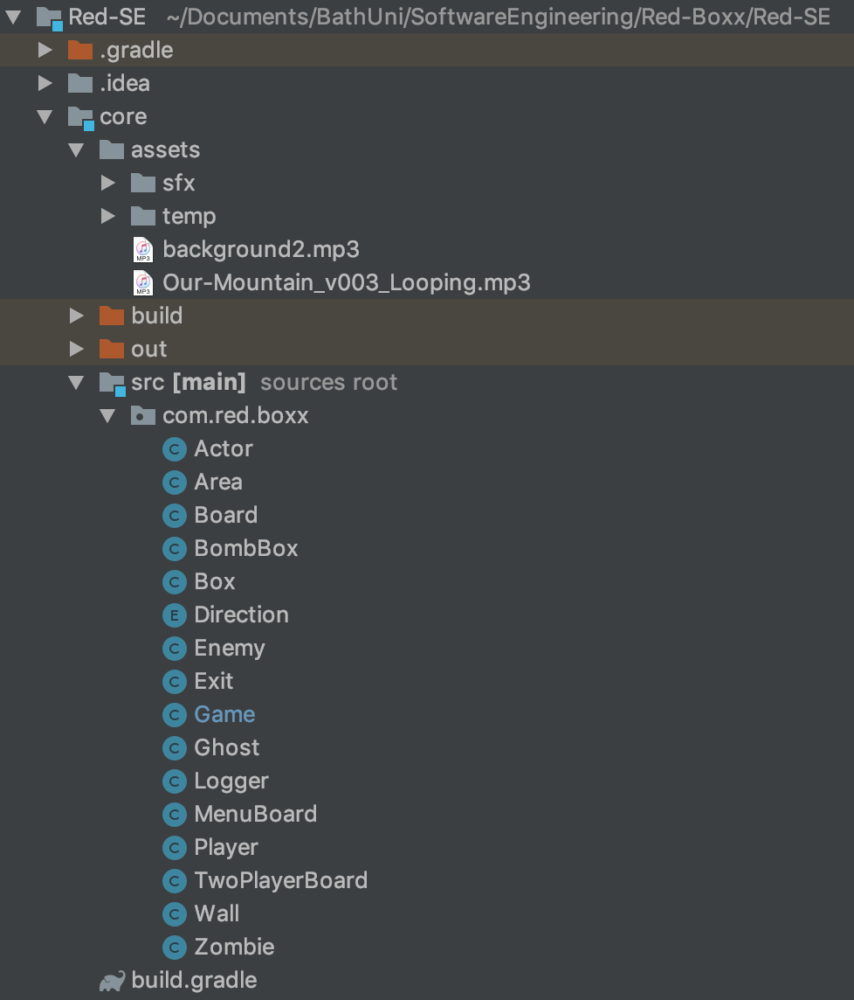
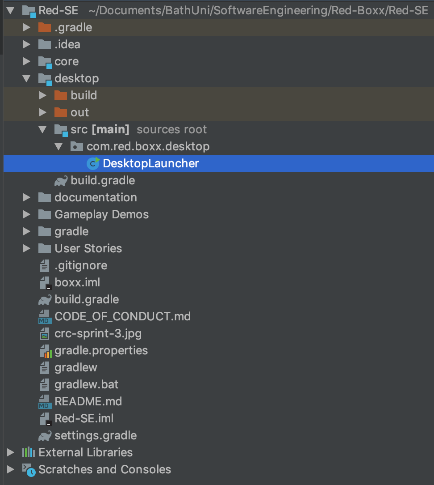
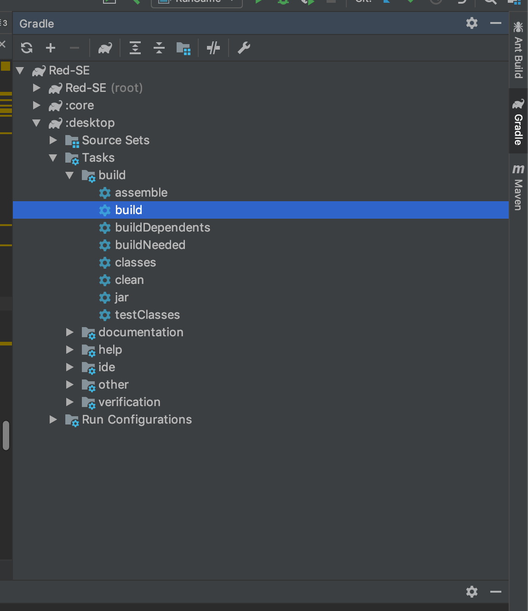
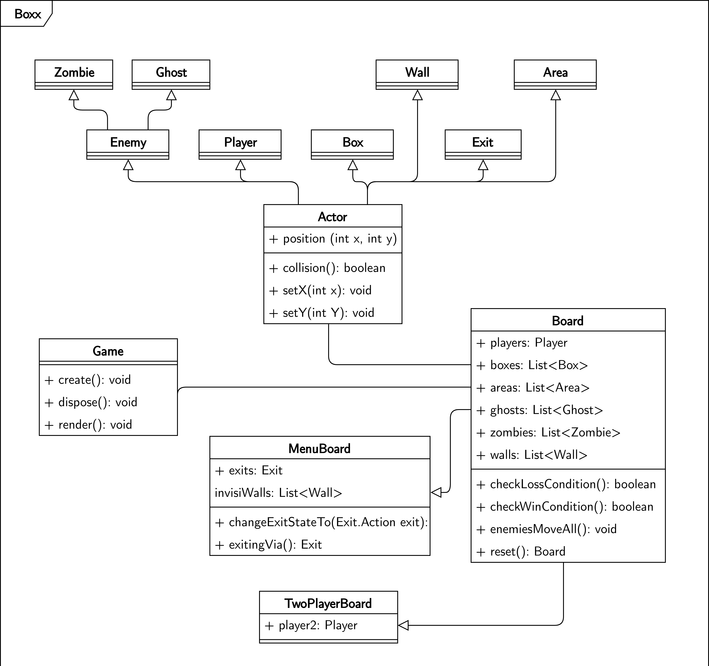

# Maintenance Guide
This maintenance guide is aimed at any developers that wish to contribute to the project.

## 1 System Requirements

Before starting development of Boxx, you must ensure that you have the following software installed:
- OS: tried and tested on Mac OSX 10.14.1 and Windows 10;
- JDK 1.8.0_161 (or higher);
- IntelliJ Community 2018.3 (or higher);
- LibGDX 1.6.1 (or higher);
- Gradle 4.10.2 (or higher).

## 2 Run and Build the Game

1. First of all let's set up the SDK. Navigate to the `Project Structure` (<kbd>command</kbd> + <kbd>;</kbd>) and make sure the `Project SDK` is set to `Java 1.8` and that the `Project Language Level` is set to `8`:
</a>

2. Next check that the `SDK` is set to 1.8:
</a>

3. You should also check that your Gradle filepath is configured correctly. Go to your `Preferences` (<kbd>command</kbd> + <kbd>,</kbd>) and set these to the appropriate directory:
</a>

4. To run the game in Intellij, select `Edit Configurations...`:
</a>

5. Make sure that the `Main Class` is set to `com.red.boxx.desktop.DesktopLauncher`;
6. Make sure the `Working directory` is set to `/core/assets`;
7. Make sure that `Use classpath of module` is set to `desktop_main`;
8. Make sure that the `JRE` is set to `1.8`:
</a>

9: All of the assets are stored in `/core/assets`, this includes sprites, music and sound effects;

10. The core codebase is stored in `/core/src/com/red/boxx`:
</a>

11. The codebase for the desktop version is located at `/desktop/src/com/red/boxx/desktop`:
</a>

12. To build the desktop standalone .jar file. Go to the Gradle option located at `:desktop/Tasks/build/build`. This will create a .jar file at the location `/desktop/build/libs/`:
</a>

## 3 Product Overview & Class Architecture
1. The Javadoc for the classes can be viewed at: http://boxx-javadoc.surge.sh/
2. The following UML diagram explains the class relationships:

</a>

3. If you wish to extend the program then you can do so by creating new classes that extend the existing classes. For example, to create a new type of enemy, simply extend your new class from the `Enemy` class.

4. In order to add levels to the game, you must create a '.txt' file in the correct format (see the example below), and place it in the `/assets/levels/` folder.When designing levels for the game, maps can be constructed using the following characters:

| Character | Results in |
| --------- | ---------- |
| \n        | New Line   |
| #         | Wall       |
| @ | Player |
| + | Second player |
| $         | Box        |
| . | Finishing area |
| % | Box on a finishing area |
| g | Ghost |
| z | Ogre |
|   | Empty space |
| e | Exit |
| r | Main menu |
| i | Settings menu |
| R | Help menu |
| s | Single player menu |
| S | Start a single player game |
| c | Continue a single player game |
| m | Multi player menu |
| M | Start a multi player game |
| C | Continue a multi player game |
| n | Continue game (only if a game is in progress) |
| &#124; | Invisible, box blocking wall |

An example map is show below:
```
###############################
#      # #                #  .#
#      #     #      #  #  #  ##
# $g#     #      #   g    ## ##
#      #   # ### #    #    #  #
#   ###### #     # #          #
#####    # #       # # #  ## ##
#      # # #### # #  # #   #  #
#   #  # #      #   #  # # ## #
##$##       #       #  # # #  #
#   #  # #      #   #  # # # ##
### #  # # ###g # # #  # #   ##
#@  #    #      #   #        .#
###############################
```

## 4 Backlog

We have compiled a list of suggested features that could be implemented in the future. Please feel free to use these as a starting point for further development if you wish.

- Remove the 'Continue game' option from the single and multiplayer menus for players that have not yet started a game (this option currently just sends the player to level 1)
- Add the tutorial levels as a separate section, so that they don't have to be replayed every time the user starts a new game
- Add messages in-between levels notifying the player that they have finished the level
- Add sound effects, letting the player know when they have placed a box in the correct position
- Randomise the level progression to make the game more replayable
- Prevent enemies from walking back on themselves (unless they have to) in order to prevent them from blocking corridors for extended periods of time
- Add a title screen which displays whilst the game loads
- Add more levels to the game to give the player a longer experience
- Fix a bug where the 'continue game' button doesn't always work exactly as it should the first time in singleplayer
